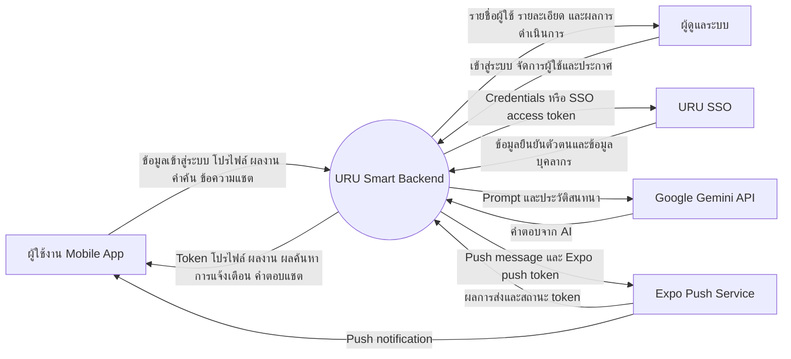
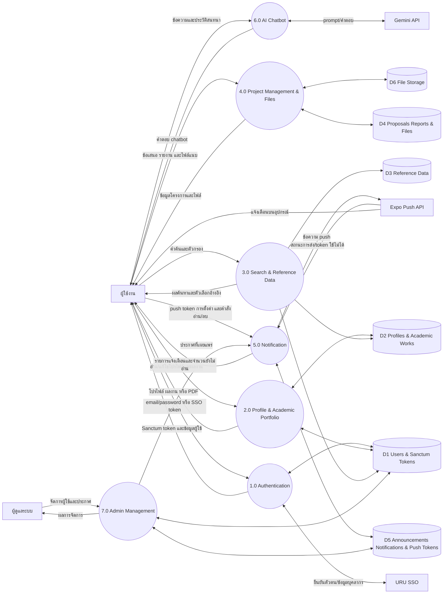
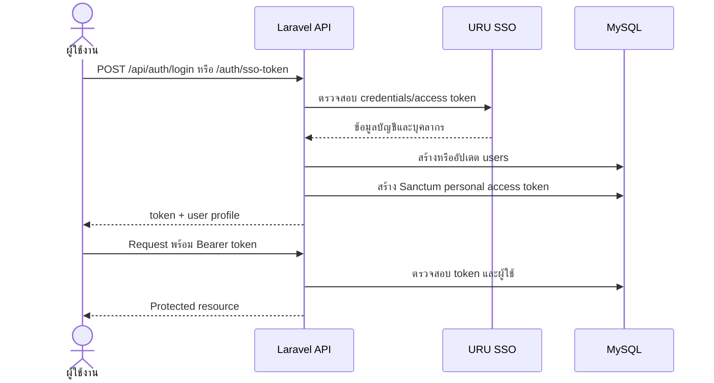
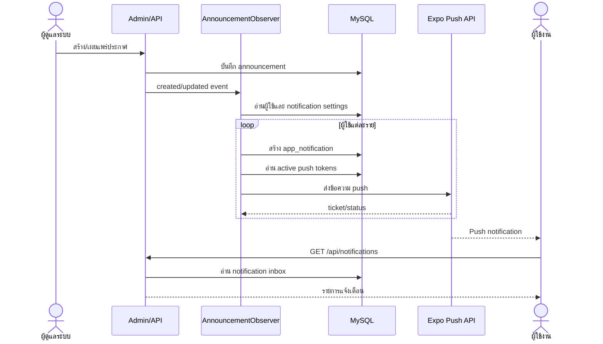

# Data Flow Diagram — URU Smart Mobile Backend

เอกสารนี้อ้างอิงจาก routes, controllers, services และ models ที่ใช้งานจริงในโปรเจกต์

## Level 0 — Context Diagram

## Level 1 — System Data Flow

## Level 2 — Authentication Flow

## Level 2 — Announcement & Notification Flow

## Data Store Mapping

| Data store | ข้อมูลหลัก |
|---|---|
| D1 Users & Auth | `users`, `personal_access_tokens`, ข้อมูลบัญชีและสิทธิ์ admin |
| D2 Profile & Portfolio | education, research, journal, book, patent, award, academic, training, lecturer, proceeding, HSP, work experience, board experience, interest และ expertise |
| D3 Reference | prefixes, positions, lines, departments, degrees, research/journal types และตัวเลือกค้นหา |
| D4 Project & Files | proposals, reports, entity files และความเป็นเจ้าของข้อมูล |
| D5 Notification | announcements, app notifications, scheduled notifications, push tokens และ notification settings |
| D6 File Storage | รูปโปรไฟล์และไฟล์แนบที่จัดเก็บผ่าน Laravel Storage |

## Supporting / Demo Flow

`GET /db-connections-demo` เป็น flow สำหรับสาธิตการเชื่อมต่อหลายฐานข้อมูล โดยอ่านผู้ใช้จาก MySQL หลัก และอ่าน/เขียน `external_training_courses` ที่ MySQL connection `mysql_second` ไม่ใช่ flow หลักของ Mobile API

